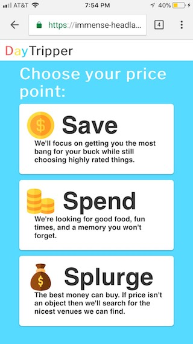
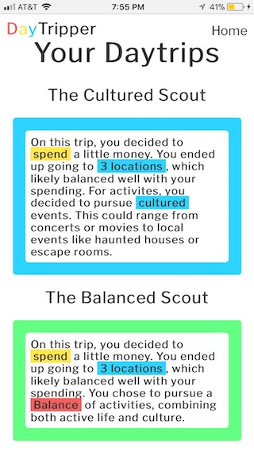

# DayTripper

https://immense-headland-39607.herokuapp.com/

## Why?

I made DayTripper with the intention of simplifying the process of going out. Too frequently I would find myself exhausted
during the discussion of what to do or where to visit with friends and family. DayTripper allows users to select
from among several choices and generates agendas of varying sizes, activities, and price ranges.

## Key Features

### Agendas
The first thing the user sees when visiting the site is a defition of daytrip. The definition dynamically
types and retypes itself, encouraging users to scroll down and begin defining it for themselves. Users are presented with 4 simple questions,
How much money do you want to spend? How much time do you want to spend? What would you like to spend it doing? And where? After
answering these simple questions a daytrip is dynamically generated for them based on their preferences.

  
### Login 
Daytripper allows visitors to sign up for accounts which store every agenda they make. Once you've created something,
click your username in the top right corner of the homepage to visit your account page. This allows you to preview all the agendas
you've previously made. 

### Saved Content 
Each agenda preview on the account page includes a small desciption whose content and style adapt to the specific choices made to creat
that agenda. This serves as a visual reminder that each and every one of your agendas are different. If a user decides to click a saved agenda
they will visit the same screen they saw upon initial creation in addition to two new features. Users will have the ability to 
change the title of each agenda in order to commemorate that particular trip in addition to the ability to delete an agenda in case
plans fell through or it didn't go as expected.

  

### For Everyone
Despite the fact that Daytripper does include the ability to sign in and save your agendas, all of it's agenda creation features
are available the second you visit the site, just scroll down to begin.

## Technologies

The frontend was created with HTMl, CSS, and JavaScript.
The backend was created with Node.js.
The database was created with MongoDB.

